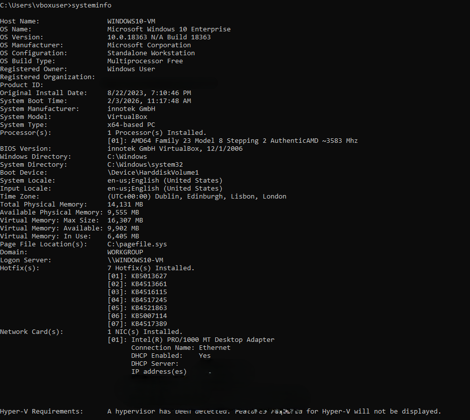

HBeethomahler Report

Number of words: 1676

Declaration of AI: The of QuillBot for Grammar and Spell-checking

# Overview

This report presents a forensic examination of a digital forensic image
(DFI) supplied by West Midlands Police in regards to Henry Beethomahler.
The investigation was carried out in strict adherence to the digital
forensics standards presented by ACPO in order to ensure objectivity,
integrity and admissibility. The methodology employed during this case
aligns clearly with ACPO principle 1: \"No action taken by law
enforcement agencies, persons employed within those agencies or their
agents should change data which may subsequently be relied upon in
court.\" All analysis of this case was carried out on a verified
forensic copy which prevents modification of the source. In this report
I will explore three core areas, forensic hygiene, identification and
understanding of the medium and lastly an analysis of the operating
systems used.

# Forensic Hygiene

## Evidence Handoff and Preparation

I was provided with the HBeethomahler Digital Forensic Image by the
module leader Harjinder Laille. A DFI is a bit-by-bit copy of a physical
storage device which is accurately able to represent all files, folders,
unallocated, free and slack space on an operating system. It is worthy
to note the differences between the raw data presented and the
pre-ingested log files of the case. The raw data is the unprocessed
forensic image of the case and are direct copies of storage media. The
pre-ingested log files refers to the initial, automatic processing of a
data source (such as a disk image, logical file, or forensic image) to
identify, parse, and analyse files immediately after they are added to a
case. The settings used to the ingest these files are represented in a
table below:

         **Module Name**          **Module Version**
  ------------------------------ --------------------
         Recent Activity                4.19.3
           Hash Lookup                  4.19.3
     File Type Identification           4.19.3
   Extension Mismatch Detector          4.19.3
     Embedded File Extractor            4.19.3
         Picture Analyzer               4.19.3
          Keyword Search                4.19.3
           Email Parser                 4.19.3
       Encryption Detection             4.19.3
   Interesting Files Identifier         4.19.3
        Central Repository              4.19.3
         PhotoRec Carver                 7.0
    Virtual Machine Extractor           4.19.3
      Data Source Integrity             4.19.3

  : Module Names and Versions

## Workstation Integrity and Standards

To ensure a \"forensically clean\" workstation I allowed Windows
Defender to carry out a malware scan on the provided sources. I did this
by selecting custom scan and choosing the file that held the
HBeethomahler case, the result of this scan was negative. A further
precaution to protect my workstation was to disconnect the virtual
machine from the network, isolating the host prevents the VM from
accessing external networks directly. By doing this a more secure
environment is created as it will prevent potential malware on the
system from spreading outside of the container of the original VM and
into the host system or other VMs.

<figure id="fig:placeholder" data-latex-placement="H">

<figcaption>Windows Defender Scan Results</figcaption>
</figure>

The virtual machine that is being used to examine the HBeethhomaler uses
a Windows operating system. Below I have provided a table of information
about the details of the OS:

  **Host Name**                 WINDOWS10-VM
  ----------------------------- ---------------------------------
  **OS Name**                   Microsoft Windows 10 Enterprise
  **OS Version**                10.0.18363 N/A Build 18363
  **OS Manufacturer**           Microsoft Corporation
  **OS Configuration**          Standalone Workstation
  **OS Build Type**             Multiprocessor Free
  **Registered Owner**          Windows User
  **Registered Organization**   
  **Product ID**                00329-10130-31990-AA053
  **Original Install Date**     8/22/2023, 7:10:46 PM
  **System Boot Time**          2/3/2026, 11:17:48 AM

<figure id="fig:placeholder" data-latex-placement="H">

<figcaption>Virtual Machine System Info</figcaption>
</figure>

## Verification and Compliance

I verified the hashes of the DFI then proceeded with the investigation.
The drive was formatted as follows: it is important to note that the MD5
hash stored is **21975d0f9f2146f3aca1f332ca456bb6** and the SHA1 hash
stored is\
**83472522c6f28debda8862d6339b749dcf392a2e**;this is the changed order
of what I was initially informed. There are no bad blocks to report. In
order to verify this I used both FTK Image Finder and the built in
resource on Autopsy, the proof of which will be shown below.

<figure id="fig:placeholder" data-latex-placement="H">

<figcaption>FTK Verification</figcaption>
</figure>

<figure id="fig:placeholder" data-latex-placement="H">

<figcaption>Autopsy Verification</figcaption>
</figure>

I confirm that, to the best of my knowledge and belief, I have complied
with the Code of Practice published by the statutory Forensic Science
Regulator 2025 version 2. I have ensured that I have used validated
tools and techniques (section 8), upheld data integrity of the case
(section 9), legal and ethical compliance (section 10)and accurate
representation of the file (section 11)[@gov2025].

#  Medium

## Partition and File System Analysis

<figure id="fig:placeholder" data-latex-placement="H">

<figcaption>Memory Allocation Chart</figcaption>
</figure>

The system appears to have a total of 48,778 allocated files, 36
unallocated files, 43,385 slack files and 29,056 directories. The
physical disk contains four separate volumes. The disk appears to be
populated with NTFS / exFAT (0x07) file system types with the rest of
the volumes being unallocated. The implementation of exFAT means that it
only uses FAT chains for fragmented files, FAT indices are not cleared
after file deletion occurs. This suggests to me that file reconstruction
is possible for some deleted
files[@ExFATImplementationNotes_SleuthKitWiki]. There are limitations to
the implementation of exFAT on systems. For example, exFAT is neither
able to produce descriptive information for the root directory nor is it
able to consistently populate time zone information fields
[@ExFATImplementationNotes_SleuthKitWiki].

There appears to be no evidence for unallocated space belonging to
\"orphaned\" data on volumes in the system.Volume 4 is an example of
slack space, all data has been over written by 0s, this is unlike volume
1 which has not been completely wiped. Volume 1 contains a few remnants
of information that is able to reveal that it has been used in order to
write.

## System Configuration and Anomalies

On this system there is evidence for system-reserved areas and potential
hidden volumes. I have identified two storage anomalies. For example,
volume 1 and volume 4 are potential hidden volumes that are filled with
unallocated memory. This suggests that some form of data concealment has
taken place on this system.

## Security, Obfuscation and Content Logic 

Obfuscation can be achieved through encryption. Encryption is a
mathematical function using a secret value---the key---which encodes
data so that only users with access to that key can read the
information. Information is encrypted and decrypted using a secret key.
(Some algorithms use a different key for encryption and decryption).
Without the key the information cannot be accessed and is therefore
protected from unauthorised or unlawful processing
[@ico_encryption_guidance_2022].

I have carried out a screening for encryption indicators on the items
contained within Volume 3. The results returned seven items with a
likely notable score for having unusually high signs of entropy, which I
have provided below:

  **Source Name**   **File Path**
  ----------------- --------------------------------------------------------------------------------------------------------------------------------------------------------------------
  AgCx_SC4.db       /img_HBeethomahler.E01/vol_vol3/Windows/Prefetch/AgCx_SC4.db
  SpeechUXRes.dll   /img_HBeethomahler.E01/vol_vol3/Windows/System32/Speech/SpeechUX/en-gb/SpeechUXRes.dll
  SpeechUXRes.dll   /img_HBeethomahler.E01/vol_vol3/Windows/System32/Speech/SpeechUX/en-us/SpeechUXRes.dll
  SpeechUXRes.dll   /img_HBeethomahler.E01/vol_vol3/Windows/winsxs/x86_microsoft-windows-s..dlanguage_en-gb.ale_31bf3856ad364e35_6.1.7600.16385_en-gb_fbeedbf956861a9d/SpeechUXRes.dll
  SpeechUXRes.dll   /img_HBeethomahler.E01/vol_vol3/Windows/winsxs/x86_microsoft-windows-s..dlanguage_en-us.ale_31bf3856ad364e35_6.1.7600.16385_en-us_f33773ca928c4cbf/SpeechUXRes.dll
  System.Web.dll    /img_HBeethomahler.E01/vol_vol3/Windows/winsxs/x86_system.web_b03f5f7f11d50a3a_6.1.7600.16385_none_cbaefa77d2cfd5e6/System.Web.dll
  System.Web.dll    /img_HBeethomahler.E01/vol_vol3/Windows/winsxs/x86_system.web_b03f5f7f11d50a3a_6.1.7600.20804_none_b4d9679fec7e52d7/System.Web.dll

I employed the use of the \"Tree View\" provided by Autopsy in order to
provide a view of the data that is represented on the system. This
enabled me to easily traverse the system to find points of interest, it
was particularly helpful for flagging notable items for my
investigation. An example of this \"Tree View\" is provided below:

<figure id="fig:placeholder" data-latex-placement="H">

<figcaption>Example of Tree View</figcaption>
</figure>

#  Operating System

## OS Profiling and Enviornment

The general information for the OS Profiles are stored at the file path
**/img HBeethomahler.E01/vol vol3/Windows/System32/config/SOFTWARE**. By
using this file path I was able to establish that the system
(BEETHOMAHLER-PC) uses Windows_NT with x86 processor architecture. The
operating system used is Windows 7 Starter with the product ID of
**55041-946-6744545-85033**. The time zone configured on the system is
Pacific Standard Time. Below I have included a table of valuable
information that relates to this:

::: adjustwidth
-2cm0cm

     **Artifact ID**                            -9223372036854775779
  ---------------------- ------------------------------------------------------------------
      **Date/Time**                           2023-02-11 05:11:45 GMT
     **Organization**    
        **Owner**                                   Beethomahler
         **Path**                                   C:\\Windows
      **Product ID**                          55041-946-6744545-85033
     **Program Name**                            Windows 7 Starter
   **Source File Path**   /img_HBeethomahler.E01/vol_vol3/Windows/System32/config/SOFTWARE

  : OS Information
:::

## User Attribution and Security

Autopsy appears to use 2 different time zones to record activity BST and
GMT, GMT is the standard for winter whilst BST is the standard of summer
and 1 hour ahead of GMT. Therefore, the recorded times can be amended to
08:08:17 GMT and 04:53:58 GMT. It is worthy to note that there are 9
known user profiles that have been created. Out of the 9 profiles that
exist only 2 have shown any login activity: Beethomahler and
Administrator. The Beethomahler profile was created in 2023-02-11
05:11:37 GMT and was lasted used on 2025-06-24 09:08:17 BST with a total
of 4 logins. The Administrator profile was created in 2023-02-11
05:11:07 GMT and was lasted used on 2009-07-14 05:53:58 BST with a total
of 1 login. This reveals to me that the Beethomahler was the only true
profile that was in use from 2023 to 2025. The user profile
administrator does not require a password and has admin privileges; the
user profile Beethomaler does not require a password and also holds
admin privileges.

Beethomahler is attributed to the Event Log Readers group. This means
Beethomahler can read event logs on the machine but does not have the
authority to modify system settings. Administrator is the built-in
account for system management and has unrestricted access to the
computer. This account belongs to the Administrators group, which has
complete control over the system. Usersh is part of the Users group.
This means Usersh can run many applications but is restricted from
making system-wide changes or administrative changes to the system.

Using the SAM database I managed to map the accounts to Security
Identifiers (SIDs), the results of which I have provided below in a
table:

::: adjustwidth
-2cm0cm
:::

## External Connectivity and Connectivity History

BEETHOMAHLER-PC has 3 registered connections to USB devices, which I
have listed below. It is unclear what information was shared from or to
these devices by the user. The last connected device to Beethomahler PC
was the USB tablet (Device ID: **5&18f54cb7&0&1**).

::: adjustwidth
-2cm0cm
:::

The file path used in order to extract information about internet
connectivity is
**/img_HBeethomahler.E01/vol_vol3/Windows/System32/config/SOFTWARE**. I
have extracted saved internet profiles and network history which are
able to provide geographic and social context. The internet profiles
associated with this machine are Network
(**FBDD9DC4-0D6C-4BEE-84A0-0C024002B97D**) and Network 2
(**7C817CAC-0C5A-4C32-9F58-1FB8075A0E19**). I have found an IP address
that can be linked to these internet profiles: **192.228.79.201**. It is
unclear to me whether this internet connection is Wi-Fi or Ethernet,
though I am led to believe that it is an Ethernet connection as it is
referred to as a cable. This is a public Wi-fi address. Using
WHOSISLLOOKUPIP, I found the relevant information listed below:

::: {#tab:whois-lookup}
  **Field**      **Value**
  -------------- --------------------------------------------------
  NetRange       192.228.79.0 - 192.228.79.255
  CIDR           192.228.79.0/24
  NetName        BROOT
  NetHandle      NET-192-228-79-0-1
  Parent         NET192 (NET-192-0-0-0-0)
  NetType        Direct Allocation
  OriginAS       (Not provided)
  Organization   B.Root-Server-OPS (BROOT)
  RegDate        2003-05-01
  Updated        2022-08-11
  Ref            <https://rdap.arin.net/registry/ip/192.228.79.0>

  : WHOIS Lookup Table
:::

::: {#tab:network-connection}
  **Field**           **Type**    **Value**
  ------------------- ----------- -------------------------------------------------
  ProfileName         REG_SZ      Network 2
  Description         REG_SZ      Network
  Managed             REG_DWORD   0x00000000 (0)
  Category            REG_DWORD   0x00000001 (1)
  DateCreated         REG_BIN     E9 07 06 00 02 00 18 00 00 00 2E 00 20 00 A4 01
  NameType            REG_DWORD   0x00000006 (6)
  DateLastConnected   REG_BIN     E9 07 06 00 02 00 18 00 01 00 07 00 2D 00 E0 03
  CategoryType        REG_DWORD   0x00000000 (0)
  IconType            REG_DWORD   0x00000000 (0)

  : Network Connection Table
:::

::: {#tab:network-connection}
  **Field**           **Type**    **Value**
  ------------------- ----------- ----------------------------------------
  ProfileGuid         REG_SZ      {FBDD9DC4-0D6C-4BEE-84A0-0C024002B97D}
  Description         REG_SZ      Network
  Source              REG_DWORD   0x00000008 (8)
  DnsSuffix           REG_SZ      cable.virginm.net
  FirstNetwork        REG_SZ      Network
  DefaultGatewayMac   REG_BIN     52 54 00 12 35 02

  : Network Connection Table
:::

::: {#tab:network-connection}
  **Field**           **Type**    **Value**
  ------------------- ----------- ----------------------------------------
  ProfileGuid         REG_SZ      {7C817CAC-0C5A-4C32-9F58-1FB8075A0E19}
  Source              REG_DWORD   0x00000008 (8)
  DefaultGatewayMac   REG_BIN     52 55 0A 00 02 02
  DnsSuffix           REG_SZ      cable.virginm.net
  Description         REG_SZ      Network 2
  FirstNetwork        REG_SZ      Network 2

  : Network Connection Table
:::

Network 2 was last modified at 2025-06-24 07:46:32 GMT +00:00. Network
was last modified at 2023-02-10 21:07:12 GMT+00:00. From this
information I am able to tell that the Beethomaler PC was used in the UK
as Virgin Media is primarily based in the UK, although it is owned by a
US based company.

<figure id="fig:placeholder" data-latex-placement="H">

<figcaption>Wi-Fi Profiles in Tree View</figcaption>
</figure>

# Conclusion

In conclusion, the analysis of the Beethomaler PC has revealed to me
that Beethomaler was operating on a Windows 7 system that had evidence
for hidden storage mediums. My investigation of this DFI has followed
ACPO to the best of my abilities, such as verification of hashes,
ensuring a forensically secure workstation and not working on the
original storage media. This ensures the reliability of my report.
Overall, I believe my report to be sufficient for the task.
